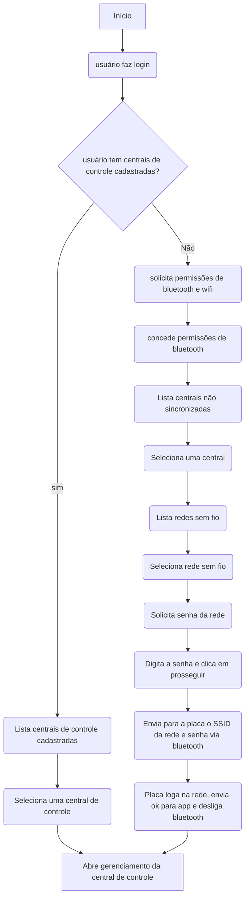

# Aplicativo

Stack para app:

* React Native
* Login Social com Firebase
* Notificações push com Firebase

Aplicativo serve para gerenciar centrais de controle, e acesso de usuários, e todas alterações são imediatament sincronizadas através de um backend.

Será primeiro testada versão android, e depois ios.

## 1. Autenticação

### Login

Tela apresentará campo de email e senha, além de links com opções para usuário se cadastrar, e botões para login social usando as seguintes redes:

* Google
* Apple
* Facebook
Haverá também link para usuário recuperar senha.

### Cadastro de usuário

Se usuário entrar optar por não usar login social, deverá passar por uma sequência de telas para cadastro.

1. Tela com nome e Email
2. Senha, e confirmação de senha

Após isso, será enviado um e-mail para com um link usuário confirmar a criação da conta. Depois disso ele pode fazer login no app.

Se usuário optar por login social, cadastraremos o e-mail e nome do login social.

### Troca de senha

Caso usuário não tenha se cadastrado com login social, ele pode realizar sua troca de senha nessa sela, com campos de senha e confirmação

### Esqueci minha senha

Caso usuário tenha esquecido sua senha, ele pode digitar seu e-mail, e com isso receber um link com um token e deeplink para abrir troca de senha no app.

## 2. Central de controle

O app pode contorlar diversas centrais de controle. Caso uusário não tenha nenhuma ainda cadastrada em sua conta,

### Setup de central de controle

O app irá solicitar permissões de acesso ao Bluetooth e Wifi.

App irá então mostrar uma sequência de telas:

1. Irá listar todos as placas de controle via bluetooth que ainda não estejam vinculadas a uma conta.
2. Após selecionar uma placa, ela será conectará bia bluetooth , e será mostrada uma lista de redes wifi.
3. Usuário deverá selecionar a rede e digitar a senha de acesso. I
4. App envia ssid e senha da rede via bluetooth para a placa.
5. Placa irá tentar conectar, em caso positivo, bate uma requisição de teste na API e avisa ao app via bluetooth que está online.
6. App mostrará uma tela onde deverá por um nome para a placa de controle que facilite a identificação.
7. Usuároi também deve selecioar tipo de central:
   * Cisterna
   * Reservatório
8. Caso usuário tenha mais de uma placa sincronizada, irá mostrar uma lista centrais de controle. Caso ele tenha apenas uma, direciona direto ao gerenciamento dela.

### Gerenciamento da central

Essa tela será similar a tela de gerenciamento do aplicativo Tuia.
Elementos da tela:

1. Gráfico com nível atual do reservatório (0%, 25%, 50%, 75%, 100%).
2. Status atual da bomba (se está ligada/desligada, e se está a placa de controle está online), com opção de ativação manual da bomba.
3. Botão para levar as configurações da bomba.

### Configurações da central

Opção as seguintes sessões:

* Configurações da bomba:
  * Mostra os 4 níveis e usuário deve selecionar em qual nível bomba deve ser ligada e em qual deve ser desligada.
  * Delay de ativação (quantos segundos depois do nível ser atingido para que a bomba seja ligada ou desligada, com valor default de 15s)

* Notificações: seleciona quais eventos o usuário quer receber notificações push no app. Possiveis notificaçòes incluem:
  1. Bomba foi iniciada.
  2. Bomba foi desligada.
  3. Um dos 4 níveis foi atingido.

* Compartilhamento
  * Abre comparilhamento do applicativo, onde ele pode enviar um deep link com um token que permite outra pessoa visualizar essa central. 
  * Comparilhamento pode permitir usuários visualizarem ou editarem essa central.

    