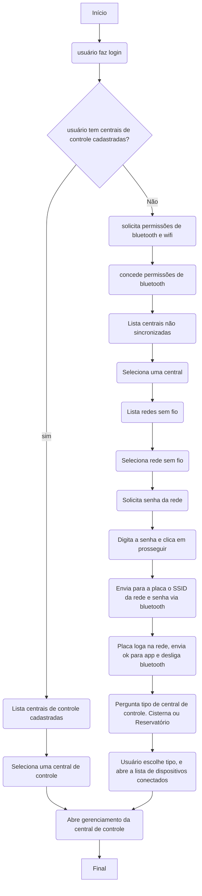

# Central de controle

Tech Stack:

- Placa DTWonder usando um microcontrolador ESP32 Relay Board.
- Projeto em C++ / platformio.

Central de controle será suada para contorlar até duas bombas d'águas.

Bomba 1, usada para reservatórios, sempre será conectada ao relay 1.

A central poderá ser conectada a rede via Wifi, ou RJ45.
Cada central deve ser associada uma chave unica, para controle interno e relatórios futuros.

## Lista de entradas e saídas

* Relay 1 - COM - energia - NO Bomba
* I1 - Botão para funcionalidades de reset e restauracão de fábrica.
* I2 - reservado
* I3 - Saida para Led de diagnóstico (pode ser acoplado um led para que acenda em ritmos diferentes, exibindo  códigos de erro diferentes.)
* I5 - sensor 25%
* I6 - sensor 50%
* I7 - sensor 75%
* I8 - sensor 100%
* V+ - positivo fonte 12v
* V- - negativo fonte 12v

## Códigos de erro para led de diagnóstico

* Led acesso sólido - operação normal
* Led piscando 1 vez - aguardando conexão bluetooth
* Led piscando 2 vezes - Aguardando dados de wifi
* Led pistcando 3 vezes - Conectando com servidor pela primeira vez
* Led piscando 1, intervalo, piscando 2 vezes - checar sensor 25%
* Led piscando 1, intervalo piscando 3 vezes - checar sensor 50%
* Led piscando 1, intervalo piscando 3 vezes - checar sensor 75%
* Led piscando 1, intervalo, piscando 3 vezes - checar sensor 100%

## Diagrmaa de setup de central de controle

